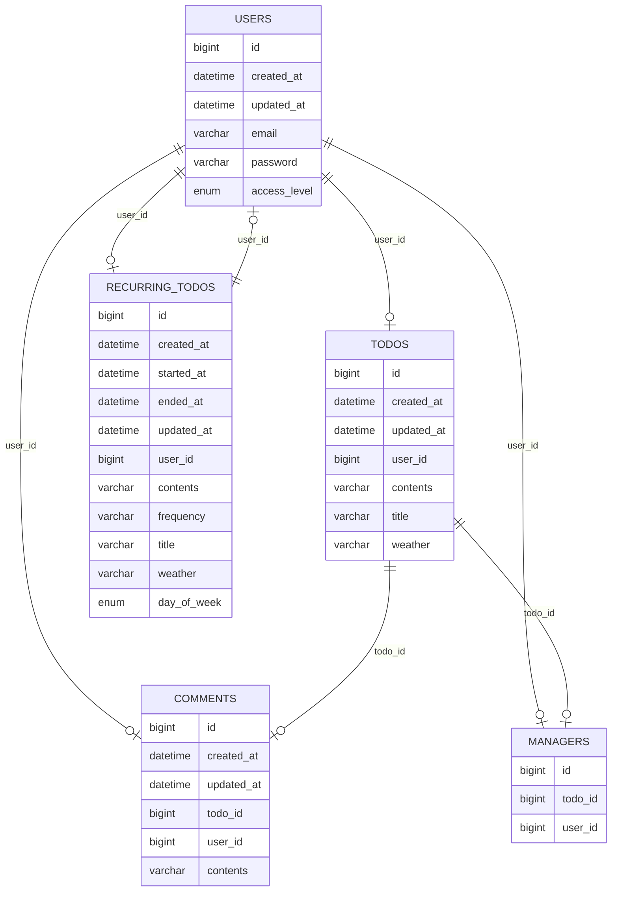

# 🗓️ Spring Advanced Practice

## 💻 Introduction
- This project is an assignment designed to evaluate students' understanding of the online lecture.
- The application is developed as a personal project.
- The application is designed with a console-based user interface.

## 📆 Development Period
- **Study**: 30/12/2024 – 01/01/2025
- **Development**: 31/12/2024 – 06/01/2025

## 🛠️ Tech Stack
- Java 17
- Spring Boot 3.4.0
- Spring Data JPA
- MySQL Driver
- BCrypt 0.10.2
- MySQL 9.1.0
- Lombok

## 🔗 ERD


## 📜 API Specification
### Basic Information
- Base URL for Auth: /auth
- Base URL for User: /users
- Base URL for Admin Users: /admin/users
- Base URL for Todos: /todos 
- Base URL for Recurring Todos: /recurring-todos
- Base URL for Admin Comments: /admin/comments/{commentId}
- Base URL for Managers: /todos/{todoId}/managers
- Response Format: JSON
- Character Encoding: UTF-8

### API List
#### API Endpoints - User

| Method | URI                   | Description         | Request Body                     | Request Parameters | Path Variables | Response Code |
|--------|-----------------------|---------------------|----------------------------------|--------------------|----------------|---------------|
| POST   | /auth/sign-up         | Sign up user        | `email` `password` `accessLevel` |                    |                | 201           |
| POST   | /auth/sign-in         | Sign in user        | `email` `password`               |                    |                | 200           |
| GET    | /users/{userId}       | Read specific user  |                                  |                    | `userId`       | 200           | 
| PUT    | /users                | Update password     | `oldPassword` `newPassword`      |                    |                | 200           |
| PATCH  | /admin/users/{userId} | Update access level | `accessLevel`                    |                    | `userId`       | 200           |

#### API Endpoints - Todo
| Method | URI              | Description        | Request Body                | Request Parameters         | Path Variables | Response Code |
|--------|------------------|--------------------|-----------------------------|----------------------------|----------------|---------------|
| POST   | /todos           | Create todo        | `title` `contents`          |                            |                | 201           |
| GET    | /todos           | Read all todos     |                             | `page` `size`              |                | 200           |
| GET    | /todos/{todoId}  | Read specific todo |                             |                            | `todoId`       | 200           |

#### API Endpoints - Comment
| Method | URI                         | Description           | Request Body        | Request Parameters | Path Variables | Response Code |
|--------|-----------------------------|-----------------------|---------------------|--------------------|----------------|---------------|
| POST   | /todos/{todoId}/comments    | Create comment        | `contents`          |                    | `todoId`       | 201           |
| GET    | /todos/{todoId}/comments    | Read all comments     |                     |                    | `todoId`       | 200           |
| DELETE | /admin/comments/{commentId} | Delete comment        |                     |                    | `commentId`    | 200           |

#### API Endpoints - Manager
| Method | URI                                  | Description       | Request Body      | Request Parameters | Path Variables        | Response Code |
|--------|--------------------------------------|-------------------|-------------------|--------------------|-----------------------|---------------|
| POST   | /todos/{todoId}/managers             | Create manager    | `managerUserId`   |                    | `todoId`              | 201           |
| GET    | /todos/{todoId}/managers             | Read all managers |                   |                    | `todoId`              | 200           |
| DELETE | /todos/{todoId}/managers/{managerId} | Delete manager    |                   |                    | `todoId`, `managerId` | 200           |


### API Details
#### Request Body Details - User
1. **`POST` Create(Sign up) User**
    ```json
    {
        "email" : "사용자 이메일",
        "password" : "비밀번호",
        "accessLevel" : "user"
    }
    ```

2. **`POST` Create(Sign in) User**
    ```json
    {
        "email" : "사용자 이메일",
        "password" : "비밀번호"
    }
    ``` 

3. **`PUT` Update Password**
    ```json
    {
        "oldPassword" : "기존의 비밀번호",
        "newPassword" : "새로운 비밀번호"
    }
    ```

4. **`PATCH` Update Access Level**
    ```json
    {
        "accessLevel" : "admin"
    }
    ```

#### Request Body Details - Todo
1. **`POST` Create Todo**
    ```json
    {
        "title": "할 일 제목",
        "contents": "할 일 내용"
    }
    ```

#### Request Body Details - Comment
1. **`POST` Create Comment**
    ```json
    {
        "contents" : "댓글 내용"
    }
    ```

#### Request Body Details - Manager
1. **`POST` Create Manager**
    ```json
    {
        "managerUserId": 1
    }
    ```

#### Response Body Details - User
1. **`POST` Create(Sign up) User**
 ```json
 {
     "bearerToken" : "JWT bearer token"
 }
 ```

2. **`POST` Create(Sign in) User**
 ```json
 {
     "bearerToken" : "JWT bearer token"
 }
 ```

3. **`GET` Read Specific User**
    ```json
    {
        "id" : 1,
        "email" : "사용자 이메일"
    }
    ```

#### Response Body Details - Todo
1. **`CREATE` Create Todo**
    ```json
    {
        "id" : 1,
        "title" : "할 일 제목",
        "contents" : "할 일 내용",
        "weather" : "날씨 정보",
        "createdAt" : "2024-12-16 14:46:03",
        "updatedAt" : "2024-12-16 14:46:03",
        "user": {
            "id": 1,
            "email": "작성자 이메일"
        }
    }
    ```

2. **`GET` Read all Todos**
    ```json
    [
        {
            "id" : 1,
            "title" : "할 일 제목 1",
            "contents" : "할 일 내용 1",
            "weather" : "날씨 정보 1",
            "createdAt" : "2024-12-17 14:00:00",
            "updatedAt" : "2024-12-17 15:00:00",
            "user": {
                "id": 1,
                "email": "작성자 이메일 1"
            }
        },
        {
            "id" : 2,
            "title" : "할 일 제목 2",
            "contents" : "할 일 내용 2",
            "weather" : "날씨 정보 2",
            "createdAt" : "2024-12-16 10:20:00",
            "updatedAt" : "2024-12-16 10:20:30",
            "user": {
                "id": 2,
                "email": "작성자 이메일 2"
            }
        },
        {
            "id" : 3,
            "title" : "할 일 제목 3",
            "contents" : "할 일 내용 3",
            "weather" : "날씨 정보 3",
            "createdAt" : "2024-12-16 01:10:15",
            "updatedAt" : "2024-12-16 01:10:15",
            "user": {
                "id": 3,
                "email": "작성자 이메일 3"
            }
        }
    ]
    ```

3. **`GET` Read specific Todo**
    ```json
    {
        "id" : 1,
        "title" : "할 일 제목",
        "contents" : "할 일 내용",
        "weather" : "날씨 정보",
        "createdAt" : "2024-12-16 14:46:03",
        "updatedAt" : "2024-12-16 14:46:03",
        "user": {
            "id": 1,
            "email": "작성자 이메일"
        }
    }
    ```

#### Response Body Details - Comment
1. **`CREATE` Create Comment**
```json
{
   "id": 1,
   "contents": "댓글 내용",
   "user": {
      "id": 1,
      "email": "사용자 이메일"
   }
}
```

2. **`GET` Read all Comments**
```json
[
   {
      "id": 1,
      "contents": "댓글1 내용",
      "user": {
         "id": 1,
         "email": "일정1 작성자의 이메일"
      }
   },
   {
      "id": 2,
      "contents": "댓글2 내용",
      "user": {
         "id": 2,
         "email": "일정2 작성자의 이메일"
      }
   }
]
```

#### Response Body Details - Manager
1. **`POST` Create Manager**
    ```json
    {
        "id": 1,
        "user": {
            "id": 2,
            "email": "user@example.com"
        }
    }
    ```

2. **`GET` Read all Managers**
    ```json
    [
        {
            "id": 1,
            "user": {
                "id": 2,
                "email": "user1@example.com"
            }
        },
        {
            "id": 2,
            "user": {
                "id": 3,
                "email": "user2@example.com"
            }
        }
    ]
    ```

### Error Response Code
#### Description
| HTTP Status | Description               | When Returned                                                                 |
|-------------|---------------------------|-------------------------------------------------------------------------------|
| 400         | Bad Request               | Required fields are missing <br/> Invalid input in request body or parameters |
| 401         | Unauthorized              | Authentication fails <br/> User is not signed in or token is invalid          |
| 403         | Forbidden                 | User does not have permission                                                 |
| 404         | Not Found                 | Resource cannot be found                                                      |
| 500         | Internal Server Error     | A server error occurs                                                         |

#### Examples
| HTTP Status | Message Example                                                                 |
|-------------|---------------------------------------------------------------------------------|
| 400         | "<Field Name> is required."                                                     |
| 401         | "Please log in." <br/> "Password does not match." <br/> "Email does not match." |
| 403         | "You are not authorized to perform this action."                                |
| 404         | "The provided id does not exist. Please try again."                             |
| 500         | "An error occurred. Please try again later."                                    |

### Request Body Description
#### Field Information - User
| Field Name  | Data Type             | Mandatory Status | Description                                                                                               |
|-------------|-----------------------|------------------|-----------------------------------------------------------------------------------------------------------|
| id          | Long                  | Optional         | Identifier for each user  <br/> Required for **GET**, or **PATCH** requests                               |
| email       | String                | Mandatory        | User's email address <br/> Must be unique                                                                 |
| password    | String                | Mandatory        | User's password                                                                                           |
| accessLevel | enum (`AccessLevel`)  | Mandatory        | Access level of user. <br/> Can be **ADMIN** or **USER** <br/> Used for role-based access control         |
| createdAt   | LocalDateTime         | Not Included     | The timestamp when the user is created  <br/> Automatically stored in the database upon creation          |
| updatedAt   | LocalDateTime         | Not Included     | The timestamp when the user is last updated  <br/> Automatically stored in the database upon modification |

#### Field Information - Todo
| Field Name | Data Type     | Mandatory Status | Description                                                                                              |
|------------|---------------|------------------|----------------------------------------------------------------------------------------------------------|
| id         | Long          | Optional         | Identifier for each todo <br/> Required for **GET** requests                                             |
| title      | String        | Mandatory        | Title of todo                                                                                            |
| contents   | String        | Mandatory        | Detailed description of todo <br/> Should be an empty String(`" "`) when the value is null               |
| weather    | String        | Not Included     | Weather information related to todo <br/> Automatically stored in the database upon creation             |
| createdAt  | LocalDateTime | Not Included     | The timestamp when the todo is created  <br/> Automatically stored in the database upon creation         |
| updatedAt  | LocalDateTime | Not Included     | The timestamp when the todo is last updated <br/> Automatically stored in the database upon modification |

#### Field Information - Comment
| Field Name   | Data Type     | Mandatory Status | Description                                                                                                 |
|--------------|---------------|------------------|-------------------------------------------------------------------------------------------------------------|
| id           | Long          | Optional         | Identifier for each comment <br/> Required for **GET**, **PATCH**, or **DELETE** requests                   |
| contents     | String        | Mandatory        | Contents of comment <br/> Must be between 1 and 500 characters                                              |
| userId       | Long          | Mandatory        | Identifier of user who created the comment <br/>  Required for **CREATE** request                           |
| todoId       | Long          | Mandatory        | Identifier of the associated todo <br/> Required for **CREATE** request                                     |
| createdAt    | LocalDateTime | Not Included     | The timestamp when the comment is created <br/> Automatically stored in the database upon creation          |
| updatedAt    | LocalDateTime | Not Included     | The timestamp when the comment is last updated <br/> Automatically stored in the database upon modification |

#### Field Information - Manager
| Field Name   | Data Type     | Mandatory Status | Description                                                                                             |
|--------------|---------------|------------------|---------------------------------------------------------------------------------------------------------|
| id           | Long          | Optional         | Identifier for each manager <br/> Required for **DELETE** request                                       |
| userId       | Long          | Mandatory        | Identifier of user associated with manager <br/> Required for **CREATE** request                        |
| todoId       | Long          | Mandatory        | Identifier of associated todo <br/> Required for **CREATE** request                                     |

## 📊 Database Schema
### 1. USERS
```sql
CREATE TABLE users
(
    id           BIGINT AUTO_INCREMENT
        PRIMARY KEY,
    email        VARCHAR(255)           NULL,
    password     VARCHAR(255)           NULL,
    access_level ENUM ('ADMIN', 'USER') NULL,
    created_at   DATETIME(6)            NULL,
    updated_at   DATETIME(6)            NULL,
    CONSTRAINT uk_users_email
        UNIQUE (email)
);
```

### 2. TODOS
```sql
CREATE TABLE todos
(
    id          BIGINT AUTO_INCREMENT PRIMARY KEY,
    user_id     BIGINT NOT NULL,
    title       VARCHAR(255) NULL,
    contents    VARCHAR(255) NULL,
    weather     VARCHAR(255) NULL,
    created_at  DATETIME(6) NULL,
    updated_at  DATETIME(6) NULL,
    CONSTRAINT fk_user_id FOREIGN KEY (user_id) REFERENCES users (id)
);
```

### 3. COMMENTS
```sql
CREATE TABLE comments
(
   id BIGINT AUTO_INCREMENT PRIMARY KEY,
   todo_id BIGINT NOT NULL,
   user_id BIGINT NOT NULL,
   contents VARCHAR(255) NULL,
   created_at DATETIME(6) NULL,
   updated_at DATETIME(6) NULL,

   CONSTRAINT fk_user_id FOREIGN KEY (user_id) REFERENCES users (id),
   CONSTRAINT fk_todo_id FOREIGN KEY (todo_id) REFERENCES todos (id)
);
```

### 4. MANAGERS
```sql
CREATE TABLE managers
(
   id          BIGINT AUTO_INCREMENT PRIMARY KEY,
   todo_id     BIGINT NOT NULL,
   user_id     BIGINT NOT NULL,
   created_at  DATETIME(6) NULL,
   updated_at  DATETIME(6) NULL,
   CONSTRAINT fk_todo_id FOREIGN KEY (todo_id) REFERENCES todos (id),
   CONSTRAINT fk_user_id FOREIGN KEY (user_id) REFERENCES users (id)
);
```

## 🚀 Key Features
- Implements CRUD functionality for `users`, `todos`, `recurring todos`, `comments` and `managers`.
- Stores data in an SQL database using JPA.
- Supports pagination: By default, 10 items per page for retrieving the todo list.
- Implements exception handling.
- Prevents duplicate sign-ups with the same email during registration.
- Encrypts passwords using BCrypt before storing them in the database.
- Implements login functionality by creating a login filter and registering configuration.

## 🔍 Characteristics
- Separates the 3-layer architecture and DTOs into different packages by URL

## 📜 More Information

- [Visit Development Journal](https://writingforever162.tistory.com)
- [Visit Troubleshooting Records](https://writingforever162.tistory.com/category/Troubleshooting%3A%20%EB%AC%B4%EC%97%87%EC%9D%B4%20%EB%AC%B8%EC%A0%9C%EC%98%80%EB%8A%94%EA%B0%80%3F)